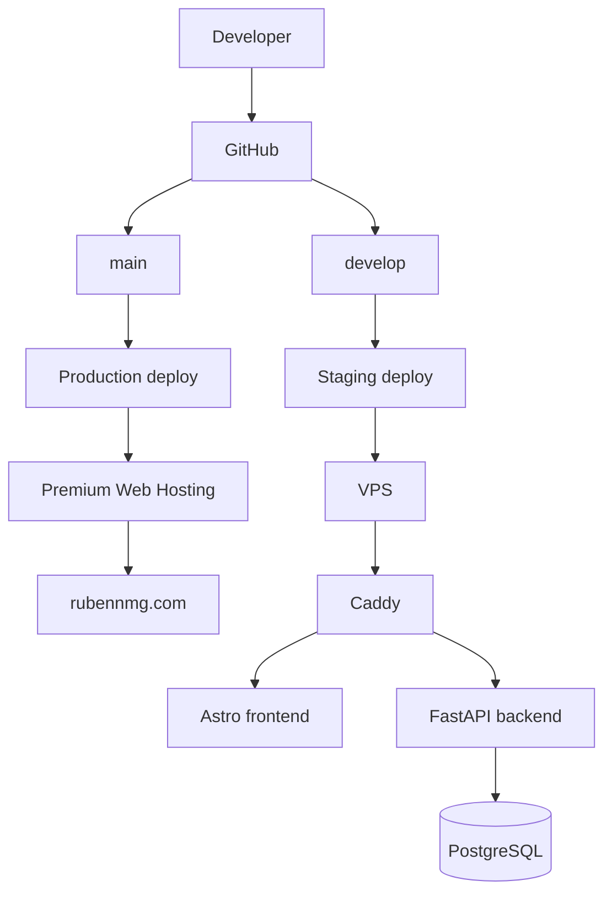

# Architecture

`rubennmg.com` is transitioning from a static Astro portfolio to a full-stack monorepo.

## Current Transition State

```txt
rubennmg.com
└── Hostinger Premium Web Hosting
    └── Production
        └── Static Astro frontend

rubennmg.cloud
└── VPS
    └── Staging
        ├── Caddy reverse proxy
        ├── Astro frontend container
        ├── FastAPI backend container
        └── PostgreSQL private Docker service
```

## Domains

- `rubennmg.com`: current production frontend on Premium Web Hosting.
- `www.rubennmg.com`: current production frontend on Premium Web Hosting.
- `rubennmg.cloud`: staging frontend on the VPS.
- `www.rubennmg.cloud`: staging frontend on the VPS.
- `api.rubennmg.cloud`: staging backend on the VPS.

## Repository Layout

```txt
apps/
  frontend/   Astro static frontend
  backend/    FastAPI backend
infra/
  staging/    Docker Compose and Caddy config
docs/         Project documentation
```

## Runtime Flow



## Infrastructure Base

- Monorepo layout.
- Static Astro frontend under `apps/frontend`.
- Minimal FastAPI backend under `apps/backend`.
- Health endpoints.
- PostgreSQL prepared in Docker Compose for staging.
- Caddy reverse proxy for staging.
- GitHub Actions CI and CD workflows.
- Dependabot.
- Documentation.

## Board Games Rankings Functional v1

- Public game pages and rankings under `/games`.
- Admin login with HttpOnly cookies.
- CSRF protection for admin mutations.
- Players management under `/admin/players`.
- Matches management under `/admin/matches`.
- Rankings calculated from individual matches.
- PostgreSQL data model with Alembic migrations.

See `docs/board-games-rankings.md` for functional routes, API endpoints and validation rules.

## Not Included Yet

- Public links from the portfolio to `/games`.
- Admin game creation; games are seeded in v1.
- Production backend on the VPS.
- CodeQL.
