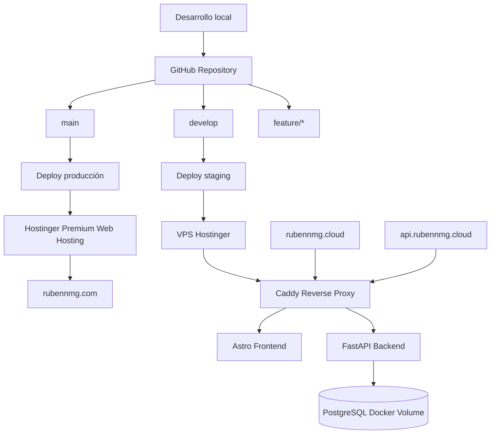

# Plan arquitectónico para Codex — Infraestructura v1 de `rubennmg.com`

## 0. Objetivo de esta primera versión

Implementar una primera versión de infraestructura y organización del proyecto para convertir el portfolio actual en un proyecto preparado para evolucionar a una aplicación full-stack.

Esta primera versión **no debe implementar todavía la lógica real de rankings**, ni login admin, ni panel de administración funcional. El objetivo es dejar preparada la base técnica.

---

## Objetivos incluidos

```txt
- Crear rama develop.
- Convertir el repo actual en monorepo.
- Mover el frontend Astro actual a apps/frontend.
- Añadir backend Python FastAPI mínimo.
- Añadir PostgreSQL en Docker con volumen persistente.
- Añadir Caddy como reverse proxy.
- Añadir Docker Compose para staging.
- Usar rubennmg.cloud como entorno staging en VPS.
- Usar api.rubennmg.cloud para backend staging.
- Mantener rubennmg.com en Premium Web Hosting como producción actual.
- Configurar GitHub Actions:
  - CI general.
  - Deploy automático de develop al VPS staging.
  - Deploy automático o aprobado de main al Premium Web Hosting.
- Configurar Dependabot.
- Añadir documentación abundante.
- Preparar .env.example.
```

---

## Objetivos excluidos de esta versión

```txt
- Login admin.
- Cookies HttpOnly.
- CRUD de jugadores.
- CRUD de partidas.
- Rankings reales.
- Panel /admin funcional.
- Migración de rubennmg.com al VPS.
- Entorno production en VPS.
- CodeQL.
```

---

# 1. Arquitectura objetivo v1

## Estado durante la transición

```txt
rubennmg.com
└── Premium Web Hosting
    └── Producción actual
        └── Astro estático

rubennmg.cloud
└── VPS Hostinger
    └── Staging
        ├── Caddy
        ├── Astro frontend dockerizado
        ├── FastAPI backend mínimo
        └── PostgreSQL privado en Docker
```

## Dominios

```txt
rubennmg.com
www.rubennmg.com
    -> Premium Web Hosting

rubennmg.cloud
www.rubennmg.cloud
    -> VPS staging frontend

api.rubennmg.cloud
    -> VPS staging backend
```

## Diagrama



---

# 2. Flujo Git elegido

Usar Gitflow simplificado:

```txt
main
    Producción actual: rubennmg.com en Premium Web Hosting

develop
    Staging: rubennmg.cloud en VPS

feature/*
    Trabajo diario

hotfix/*
    Correcciones urgentes desde main
```

## Flujo normal

```txt
feature/* -> Pull Request -> develop -> deploy staging
develop -> Pull Request -> main -> deploy production
```

## Reglas iniciales

```txt
- Proteger main.
- Requerir Pull Request hacia main.
- Requerir CI correcto antes de mergear a main.
- Usar Conventional Commits.
- develop puede quedar menos restringida al principio.
```

## Convención de commits

Ejemplos:

```txt
feat: add FastAPI health endpoint
chore: move Astro app to monorepo structure
ci: add staging deployment workflow
docs: add VPS deployment guide
infra: add Caddy reverse proxy
```

---

# 3. Estructura del repositorio

Codex debe reorganizar el repo actual a esta estructura:

```txt
rubennmg.com/
├── apps/
│   ├── frontend/
│   │   ├── public/
│   │   ├── src/
│   │   ├── astro.config.mjs
│   │   ├── package.json
│   │   ├── package-lock.json
│   │   ├── tsconfig.json
│   │   └── Dockerfile
│   │
│   └── backend/
│       ├── app/
│       │   ├── __init__.py
│       │   ├── main.py
│       │   ├── api/
│       │   │   ├── __init__.py
│       │   │   └── health.py
│       │   ├── core/
│       │   │   ├── __init__.py
│       │   │   └── config.py
│       │   └── db/
│       │       ├── __init__.py
│       │       └── session.py
│       │
│       ├── Dockerfile
│       ├── pyproject.toml
│       └── README.md
│
├── infra/
│   ├── staging/
│   │   ├── compose.yml
│   │   └── Caddyfile
│   │
│   └── README.md
│
├── docs/
│   ├── architecture.md
│   ├── git-workflow.md
│   ├── deployment-staging.md
│   ├── deployment-production-premium.md
│   ├── environment-variables.md
│   └── operations.md
│
├── .github/
│   ├── workflows/
│   │   ├── ci.yml
│   │   ├── deploy-staging.yml
│   │   └── deploy-production-premium.yml
│   │
│   └── dependabot.yml
│
├── .env.example
├── .gitignore
└── README.md
```

---

# 4. Frontend Astro

## Objetivo

Mover el Astro actual a:

```txt
apps/frontend
```

El frontend seguirá siendo estático.

## Requisitos

Codex debe:

```txt
- Mover src/ a apps/frontend/src/.
- Mover public/ a apps/frontend/public/.
- Mover package.json a apps/frontend/package.json.
- Mover package-lock.json si existe.
- Mover astro.config.mjs.
- Revisar rutas relativas si alguna se rompe.
- Verificar que npm ci y npm run build funcionan desde apps/frontend.
```

## Variable de entorno

Añadir soporte para:

```env
PUBLIC_API_URL=https://api.rubennmg.cloud
```

Aunque todavía no se consuma realmente, dejarlo documentado.

## Dockerfile del frontend

Crear:

```dockerfile
FROM node:22-alpine AS build

WORKDIR /app

COPY package*.json ./
RUN npm ci

COPY . .
RUN npm run build

FROM nginx:alpine

COPY --from=build /app/dist /usr/share/nginx/html

EXPOSE 80
```

---

# 5. Backend FastAPI mínimo

## Objetivo

Crear un backend mínimo en Python FastAPI para staging.

Debe incluir:

```txt
- Endpoint GET /health.
- Endpoint GET /api/health.
- Conexión preparada a PostgreSQL.
- SQLAlchemy como ORM.
- Configuración mediante variables de entorno.
- No implementar autenticación todavía.
- No implementar modelos de rankings todavía.
```

## Stack backend

Usar:

```txt
Python 3.12
FastAPI
Uvicorn
SQLAlchemy
psycopg
Pydantic Settings
Alembic, preparado pero sin migraciones complejas todavía
```

## `pyproject.toml`

Codex debe usar un setup moderno. Puede usar `uv` o `pip`. Para simplicidad inicial, usar `pyproject.toml` con dependencias estándar.

Dependencias mínimas:

```txt
fastapi
uvicorn[standard]
sqlalchemy
psycopg[binary]
pydantic-settings
alembic
```

## Estructura backend

```txt
apps/backend/
├── app/
│   ├── main.py
│   ├── api/
│   │   └── health.py
│   ├── core/
│   │   └── config.py
│   └── db/
│       └── session.py
├── Dockerfile
├── pyproject.toml
└── README.md
```

## Endpoint `/health`

Debe devolver algo así:

```json
{
  "status": "ok",
  "service": "rubennmg-api",
  "environment": "staging"
}
```

## Endpoint `/api/health/db`

Opcional pero recomendable para esta v1:

```json
{
  "status": "ok",
  "database": "connected"
}
```

Si la base de datos no responde, debe devolver error controlado.

---

# 6. PostgreSQL

## Objetivo

PostgreSQL debe ejecutarse como contenedor dentro de Docker Compose.

## Requisitos

```txt
- No exponer puerto 5432 al exterior.
- Usar volumen persistente.
- Usar variables desde .env.staging en el VPS.
- Backend accede por nombre de servicio: db.
```

## Configuración esperada

```yaml
db:
  image: postgres:16
  restart: unless-stopped
  environment:
    POSTGRES_DB: rubennmg_staging
    POSTGRES_USER: rubennmg
    POSTGRES_PASSWORD: ${POSTGRES_PASSWORD}
  volumes:
    - postgres_data:/var/lib/postgresql/data
  networks:
    - internal
```

---

# 7. Caddy

## Objetivo

Usar Caddy como reverse proxy con HTTPS automático.

## Caddyfile staging

Crear:

```txt
rubennmg.cloud, www.rubennmg.cloud {
    reverse_proxy frontend:80
}

api.rubennmg.cloud {
    reverse_proxy backend:8000
}
```

## Requisitos

```txt
- Caddy debe exponer 80 y 443.
- frontend y backend solo deben estar expuestos dentro de la red Docker.
- PostgreSQL debe estar solo en la red interna.
```

---

# 8. Docker Compose staging

Crear:

```txt
infra/staging/compose.yml
```

## Compose objetivo

```yaml
services:
  caddy:
    image: caddy:2
    restart: unless-stopped
    ports:
      - "80:80"
      - "443:443"
    volumes:
      - ./Caddyfile:/etc/caddy/Caddyfile:ro
      - caddy_data:/data
      - caddy_config:/config
    depends_on:
      - frontend
      - backend
    networks:
      - web

  frontend:
    build:
      context: ../../apps/frontend
    restart: unless-stopped
    environment:
      PUBLIC_API_URL: ${PUBLIC_API_URL}
    networks:
      - web

  backend:
    build:
      context: ../../apps/backend
    restart: unless-stopped
    environment:
      APP_ENV: staging
      DATABASE_URL: postgresql+psycopg://rubennmg:${POSTGRES_PASSWORD}@db:5432/rubennmg_staging
      CORS_ALLOWED_ORIGINS: ${CORS_ALLOWED_ORIGINS}
    depends_on:
      - db
    networks:
      - web
      - internal

  db:
    image: postgres:16
    restart: unless-stopped
    environment:
      POSTGRES_DB: rubennmg_staging
      POSTGRES_USER: rubennmg
      POSTGRES_PASSWORD: ${POSTGRES_PASSWORD}
    volumes:
      - postgres_data:/var/lib/postgresql/data
    networks:
      - internal

volumes:
  caddy_data:
  caddy_config:
  postgres_data:

networks:
  web:
  internal:
```

---

# 9. Variables de entorno

Crear `.env.example` en la raíz:

```env
# Frontend
PUBLIC_API_URL=https://api.rubennmg.cloud

# Backend
APP_ENV=staging
CORS_ALLOWED_ORIGINS=https://rubennmg.cloud,https://www.rubennmg.cloud,https://rubennmg.com,https://www.rubennmg.com

# Database
POSTGRES_PASSWORD=change-me
```

En el VPS, documentar que debe existir:

```txt
/home/deploy/apps/rubennmg.com/infra/staging/.env.staging
```

Con:

```env
PUBLIC_API_URL=https://api.rubennmg.cloud
APP_ENV=staging
CORS_ALLOWED_ORIGINS=https://rubennmg.cloud,https://www.rubennmg.cloud,https://rubennmg.com,https://www.rubennmg.com
POSTGRES_PASSWORD=valor_real_seguro
```

No subir `.env.staging` al repo.

---

# 10. GitHub Actions — CI

Crear:

```txt
.github/workflows/ci.yml
```

## Objetivo

Ejecutar CI en:

```txt
pull_request hacia main
pull_request hacia develop
push a main
push a develop
```

## Jobs

```txt
frontend:
- checkout
- setup node 22
- npm ci
- npm run build

backend:
- checkout
- setup python 3.12
- instalar dependencias
- comprobar import de app
- opcional: ejecutar tests si existen

docker:
- build frontend Docker image
- build backend Docker image
```

## Importante

Como la primera versión puede no tener tests, no fallar por ausencia de tests. Pero dejar preparada la estructura para añadirlos.

---

# 11. GitHub Actions — deploy staging

Crear:

```txt
.github/workflows/deploy-staging.yml
```

## Trigger

```txt
push a develop
```

## Environment

```txt
staging
```

## Funcionamiento

El workflow debe conectarse por SSH al VPS y ejecutar:

```bash
cd /home/deploy/apps/rubennmg.com
git fetch origin
git checkout develop
git pull origin develop
cd infra/staging
docker compose --env-file .env.staging -f compose.yml up -d --build
docker image prune -f
```

## Secrets necesarios en GitHub

En environment `staging`:

```txt
VPS_HOST
VPS_USER
VPS_SSH_KEY
```

## Nota

Codex debe documentar cómo crear la clave SSH de despliegue y dónde colocar la pública en el VPS.

---

# 12. GitHub Actions — deploy producción actual a Premium

Crear:

```txt
.github/workflows/deploy-production-premium.yml
```

## Trigger

```txt
push a main
```

## Environment

```txt
production
```

Debe quedar preparado para usar aprobación manual desde GitHub Environments.

## Funcionamiento

```txt
- Build del Astro frontend desde apps/frontend.
- Subida del contenido de apps/frontend/dist/ al Premium Web Hosting por FTP/SFTP.
```

## Secrets necesarios

En environment `production`:

```txt
PREMIUM_FTP_HOST
PREMIUM_FTP_USER
PREMIUM_FTP_PASSWORD
PREMIUM_FTP_TARGET_DIR
```

## Acción sugerida

Usar:

```txt
SamKirkland/FTP-Deploy-Action
```

## Importante

No borrar ni tocar backend en producción, porque producción actual solo es frontend estático en Premium.

---

# 13. Dependabot

Crear:

```txt
.github/dependabot.yml
```

## Requisitos

Dependabot debe revisar:

```txt
- npm en apps/frontend.
- pip/pyproject en apps/backend.
- GitHub Actions.
- Dockerfiles.
```

## Configuración propuesta

```yaml
version: 2

updates:
  - package-ecosystem: "npm"
    directory: "/apps/frontend"
    schedule:
      interval: "weekly"
    target-branch: "develop"
    open-pull-requests-limit: 5
    labels:
      - "dependencies"
      - "frontend"

  - package-ecosystem: "pip"
    directory: "/apps/backend"
    schedule:
      interval: "weekly"
    target-branch: "develop"
    open-pull-requests-limit: 5
    labels:
      - "dependencies"
      - "backend"

  - package-ecosystem: "github-actions"
    directory: "/"
    schedule:
      interval: "weekly"
    target-branch: "develop"
    open-pull-requests-limit: 5
    labels:
      - "dependencies"
      - "github-actions"

  - package-ecosystem: "docker"
    directory: "/apps/frontend"
    schedule:
      interval: "weekly"
    target-branch: "develop"
    open-pull-requests-limit: 5
    labels:
      - "dependencies"
      - "docker"

  - package-ecosystem: "docker"
    directory: "/apps/backend"
    schedule:
      interval: "weekly"
    target-branch: "develop"
    open-pull-requests-limit: 5
    labels:
      - "dependencies"
      - "docker"
```

---

# 14. Documentación obligatoria

La documentación es parte central de esta v1.

Codex debe crear:

```txt
docs/architecture.md
docs/git-workflow.md
docs/deployment-staging.md
docs/deployment-production-premium.md
docs/environment-variables.md
docs/operations.md
```

## `docs/architecture.md`

Debe explicar:

```txt
- Arquitectura de transición.
- Uso de rubennmg.com.
- Uso de rubennmg.cloud.
- Premium vs VPS.
- Diagrama Mermaid.
- Qué entra y qué no entra en v1.
```

## `docs/git-workflow.md`

Debe explicar:

```txt
- main.
- develop.
- feature/*.
- hotfix/*.
- Conventional Commits.
- PR hacia develop.
- PR hacia main.
- Cómo hacer un hotfix.
```

## `docs/deployment-staging.md`

Debe explicar:

```txt
- Requisitos del VPS.
- Usuario deploy.
- Docker instalado.
- DNS necesario.
- Estructura esperada en /home/deploy/apps/rubennmg.com.
- Cómo crear .env.staging.
- Cómo lanzar docker compose manualmente.
- Cómo comprobar logs.
- Cómo comprobar endpoints.
```

## `docs/deployment-production-premium.md`

Debe explicar:

```txt
- Producción actual en Premium Web Hosting.
- Build del frontend.
- Deploy por FTP desde GitHub Actions.
- Secrets necesarios.
- Directorio remoto objetivo.
- Cómo hacer rollback manual.
```

## `docs/environment-variables.md`

Debe explicar:

```txt
- Variables públicas.
- Variables sensibles.
- Variables de GitHub Actions.
- Variables del VPS.
- Variables que no deben subirse al repo.
```

## `docs/operations.md`

Debe explicar:

```txt
- Comandos útiles de Docker Compose.
- Ver logs.
- Reiniciar servicios.
- Rebuild.
- Backup manual de PostgreSQL.
- Restauración básica.
- Comprobar estado de Caddy.
```

---

# 15. README principal

Actualizar el `README.md` raíz con:

```txt
- Descripción del proyecto.
- Arquitectura general.
- Entornos.
- Cómo ejecutar frontend localmente.
- Cómo ejecutar backend localmente.
- Cómo levantar staging local con Docker Compose.
- Cómo funciona Git.
- Enlaces a docs/.
```

Debe quedar claro que:

```txt
main = producción actual en rubennmg.com
develop = staging en rubennmg.cloud
```

---

# 16. Ejecución local

Aunque el foco sea infraestructura, Codex debe permitir ejecutar el proyecto localmente.

## Frontend

```bash
cd apps/frontend
npm ci
npm run dev
```

## Backend

```bash
cd apps/backend
python -m venv .venv
source .venv/bin/activate
pip install -e .
uvicorn app.main:app --reload
```

## Docker staging local

Desde:

```bash
cd infra/staging
docker compose --env-file .env.staging -f compose.yml up -d --build
```

Para local, se puede documentar una copia:

```bash
cp ../../.env.example .env.staging
```

Pero advirtiendo que en VPS debe tener secretos reales.

---

# 17. DNS requerido

Documentar que deben existir estos registros para `rubennmg.cloud`:

```txt
A     @      IP_DEL_VPS
A     www    IP_DEL_VPS
A     api    IP_DEL_VPS
```

Y que `rubennmg.com` se mantiene temporalmente apuntando al Premium Web Hosting.

---

# 18. Seguridad mínima

Codex no debe automatizar configuración del VPS con scripts, pero debe documentar comandos recomendados.

## Usuario deploy

```bash
adduser deploy
usermod -aG sudo deploy
usermod -aG docker deploy
```

## Firewall

```bash
ufw allow OpenSSH
ufw allow 80
ufw allow 443
ufw enable
```

## Buenas prácticas

```txt
- No usar root para despliegues.
- No subir .env reales.
- No exponer PostgreSQL.
- Usar secrets de GitHub.
- Usar clave SSH para GitHub Actions.
- Production requiere aprobación manual.
```

---

# 19. Backups PostgreSQL

Aunque los rankings reales no existan aún, documentar ya backups.

Comando manual:

```bash
docker compose --env-file .env.staging -f compose.yml exec db pg_dump -U rubennmg rubennmg_staging > backup_$(date +%F).sql
```

Directorio recomendado en VPS:

```txt
/home/deploy/backups/postgres
```

No implementar cron todavía, solo documentarlo.

---

# 20. Tareas concretas para Codex

## Tarea 1 — Crear rama develop

```txt
- Crear rama develop desde main.
- Trabajar todos los cambios en develop.
```

Criterio de aceptación:

```txt
- Existe rama develop.
- No se modifica main directamente.
```

---

## Tarea 2 — Convertir repo a monorepo

```txt
- Crear apps/frontend.
- Mover proyecto Astro actual a apps/frontend.
- Crear apps/backend.
- Crear infra/staging.
- Crear docs.
- Crear .github/workflows.
```

Criterio de aceptación:

```txt
- npm ci funciona en apps/frontend.
- npm run build funciona en apps/frontend.
- La estructura raíz queda limpia.
```

---

## Tarea 3 — Dockerizar frontend

```txt
- Crear apps/frontend/Dockerfile.
- Verificar build Docker.
```

Criterio de aceptación:

```bash
docker build -t rubennmg-frontend ./apps/frontend
```

---

## Tarea 4 — Crear backend FastAPI mínimo

```txt
- Crear proyecto FastAPI.
- Añadir /health.
- Añadir /api/health.
- Añadir configuración por variables.
- Añadir preparación para DB con SQLAlchemy.
```

Criterio de aceptación:

```bash
cd apps/backend
uvicorn app.main:app --reload
```

Y:

```txt
GET http://localhost:8000/health
```

Devuelve status `ok`.

---

## Tarea 5 — Dockerizar backend

```txt
- Crear apps/backend/Dockerfile.
- Exponer puerto 8000.
- Ejecutar uvicorn.
```

Criterio de aceptación:

```bash
docker build -t rubennmg-backend ./apps/backend
```

---

## Tarea 6 — Crear Docker Compose staging

```txt
- Crear infra/staging/compose.yml.
- Añadir caddy.
- Añadir frontend.
- Añadir backend.
- Añadir db.
- Añadir redes web/internal.
- Añadir volúmenes persistentes.
```

Criterio de aceptación:

```bash
cd infra/staging
docker compose --env-file .env.staging -f compose.yml up -d --build
```

Y:

```txt
frontend responde detrás de Caddy
backend responde detrás de Caddy
db no expone puerto externo
```

---

## Tarea 7 — Crear Caddyfile

```txt
- Configurar rubennmg.cloud.
- Configurar www.rubennmg.cloud.
- Configurar api.rubennmg.cloud.
```

Criterio de aceptación:

```txt
Caddy arranca sin error.
```

---

## Tarea 8 — Configurar CI

```txt
- Crear .github/workflows/ci.yml.
- Añadir job frontend.
- Añadir job backend.
- Añadir job Docker build.
```

Criterio de aceptación:

```txt
- PR hacia develop ejecuta CI.
- PR hacia main ejecuta CI.
- CI falla si frontend no compila.
- CI falla si backend no arranca/importa.
```

---

## Tarea 9 — Configurar deploy staging

```txt
- Crear .github/workflows/deploy-staging.yml.
- Trigger en push a develop.
- Usar SSH al VPS.
- Ejecutar git pull y docker compose.
```

Criterio de aceptación:

```txt
- Push a develop despliega en rubennmg.cloud.
- api.rubennmg.cloud/health responde.
```

---

## Tarea 10 — Configurar deploy producción Premium

```txt
- Crear .github/workflows/deploy-production-premium.yml.
- Trigger en push a main.
- Build del frontend.
- Subida por FTP al Premium.
```

Criterio de aceptación:

```txt
- Push a main publica dist/ en Premium Web Hosting.
- Debe usar environment production.
- Debe soportar aprobación manual configurada desde GitHub.
```

---

## Tarea 11 — Configurar Dependabot

```txt
- Crear .github/dependabot.yml.
- Configurar npm.
- Configurar pip.
- Configurar GitHub Actions.
- Configurar Docker.
```

Criterio de aceptación:

```txt
- Dependabot apunta a develop.
- No abre PRs contra main.
```

---

## Tarea 12 — Añadir documentación completa

```txt
- README principal.
- docs/architecture.md.
- docs/git-workflow.md.
- docs/deployment-staging.md.
- docs/deployment-production-premium.md.
- docs/environment-variables.md.
- docs/operations.md.
```

Criterio de aceptación:

```txt
- Una persona puede preparar el VPS siguiendo la documentación.
- Una persona puede desplegar staging manualmente siguiendo la documentación.
- Una persona puede entender main/develop/feature.
- Una persona puede configurar secrets de GitHub siguiendo la documentación.
```

---

# 21. Criterios globales de aceptación de la v1

La versión se considerará terminada cuando se cumpla:

```txt
- El repo está en formato monorepo.
- El frontend Astro compila desde apps/frontend.
- El backend FastAPI responde a /health.
- PostgreSQL levanta en Docker con volumen persistente.
- Caddy enruta frontend y backend.
- Docker Compose staging funciona.
- develop despliega automáticamente a rubennmg.cloud.
- main despliega el frontend al Premium Web Hosting.
- Dependabot está configurado.
- README y docs están completos.
- No hay secretos reales en el repo.
```

---

# 22. Orden recomendado para Codex

Codex debe implementar en este orden:

```txt
1. Crear rama develop.
2. Reorganizar repo a monorepo.
3. Verificar frontend Astro.
4. Dockerizar frontend.
5. Crear backend FastAPI mínimo.
6. Dockerizar backend.
7. Crear compose staging con PostgreSQL y Caddy.
8. Añadir .env.example.
9. Añadir CI.
10. Añadir deploy staging.
11. Añadir deploy production premium.
12. Añadir Dependabot.
13. Añadir documentación completa.
14. Revisar criterios de aceptación.
```

---

# 23. Prompt listo para Codex

Puedes pasarle esto directamente a Codex:

```txt
Quiero implementar la primera versión de infraestructura del repositorio rubennmg.com.

Decisiones tomadas:
- Crear rama develop desde main y trabajar ahí.
- Convertir el repo en monorepo.
- Mover el proyecto Astro actual a apps/frontend.
- Crear backend mínimo en Python FastAPI en apps/backend.
- Backend v1 solo tendrá /health, /api/health y preparación de conexión a PostgreSQL con SQLAlchemy.
- Usar PostgreSQL en Docker con volumen persistente.
- Usar Caddy como reverse proxy.
- Usar Docker Compose para staging.
- Staging vivirá en rubennmg.cloud y api.rubennmg.cloud sobre un VPS Hostinger.
- Producción actual seguirá en rubennmg.com sobre Hostinger Premium Web Hosting.
- main = producción.
- develop = staging.
- feature/* = trabajo diario.
- hotfix/* = correcciones urgentes.
- Configurar GitHub Actions:
  - ci.yml para frontend, backend y Docker build.
  - deploy-staging.yml para desplegar develop en VPS por SSH.
  - deploy-production-premium.yml para desplegar main al hosting Premium por FTP.
- Configurar Dependabot para npm, pip, Docker y GitHub Actions.
- Añadir documentación abundante en README y docs/.
- No implementar todavía login admin, rankings reales, CRUD ni panel admin.
- No subir secretos reales.
- Crear .env.example.

Estructura objetivo:

apps/frontend
apps/backend
infra/staging
docs
.github/workflows

Implementa los cambios de forma incremental y asegurándote de que:
- apps/frontend compila con npm ci && npm run build.
- apps/backend arranca con uvicorn app.main:app --reload.
- docker build funciona para frontend y backend.
- docker compose en infra/staging levanta caddy, frontend, backend y db.
- /health responde ok.
- PostgreSQL no expone puerto externo.
- La documentación explica claramente cómo preparar el VPS, configurar DNS, configurar secrets de GitHub, desplegar staging, desplegar producción actual y trabajar con ramas.

No implementes funcionalidades de negocio todavía. Esta v1 es solo infraestructura y base de arquitectura.
```

---

# 24. Recomendación de implementación incremental

Aunque el plan global esté definido, conviene implementarlo en cambios pequeños.

## PR 1 — Monorepo + frontend

```txt
- Crear develop.
- Mover Astro a apps/frontend.
- Ajustar package paths.
- Añadir CI frontend.
- Actualizar README mínimo.
```

## PR 2 — Backend FastAPI mínimo

```txt
- Crear apps/backend.
- Añadir FastAPI.
- Añadir /health.
- Añadir SQLAlchemy config.
- Añadir Dockerfile backend.
- Ampliar CI backend.
```

## PR 3 — Infra staging

```txt
- Añadir infra/staging/compose.yml.
- Añadir Caddyfile.
- Añadir PostgreSQL.
- Añadir .env.example.
- Documentar deploy local y VPS.
```

## PR 4 — CD staging

```txt
- Añadir deploy-staging.yml.
- Documentar secrets.
- Documentar preparación VPS.
```

## PR 5 — CD producción Premium

```txt
- Añadir deploy-production-premium.yml.
- Documentar FTP secrets.
- Documentar rollback.
```

## PR 6 — Dependabot + documentación completa

```txt
- Añadir dependabot.yml.
- Completar docs/.
- Revisar criterios de aceptación.
```
